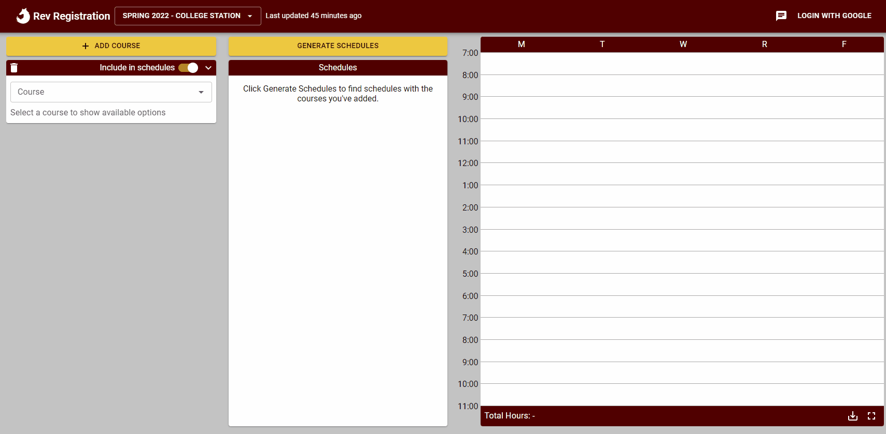

# Rev Registration

[](https://github.com/aggie-coding-club/rev-registration/actions?query=branch%3Amaster+workflow%3A%22Backend+CI%22)
[](https://github.com/aggie-coding-club/rev-registration/actions?query=branch%3Amaster+workflow%3A%22Frontend+CI%22)



## Description

Rev Registration is an automatic class scheduler for Texas A&M, aimed at easing the process
of course registration by generating compatible schedules given the courses a student would
like to take and what preferences they have. Simply select a term, pick your courses, mark off when
you're not available, and we'll generate schedules for you!

For instance, imagine you've settled on 3 sections of a course you are fine with having and are having
trouble finding a schedule without conflicts. Select all 3 under the Section customization level,
add in your other classes, and let the schedule generator create schedules for you without time conflicts!

**Features:**

- Automatic schedule generation
- Block off busy times (availabilities)
- Displays grade distribution
- Shows current seats remaining
- Search by course number or title
- Filter for only honors or online sections
- Visual display of schedules
- Remembers preferences for easy access during registration
- Login with Google
- Save, rename, and delete generated schedules
- Filter out full sections

## Installation

Follow these steps to start a local Django server using a PostgreSQL database:

0) For Windows, use powershell instead of command prompt.
    - Some commands don't work 100% on command prompt.
1) If you don’t have it already, download Python from [here](https://www.python.org/downloads/).
2) Clone the current project: `git clone https://github.com/aggie-coding-club/Rev-Registration.git`
    - This will clone the project into the current directory
3) To install the packages, you first need to make a virtual environment for Python, which will help us ensure that our libraries & Python versions are unified. You can do so be by running:
    - It is recommended to put the virtual environment in the settings directory: `cd ./autoscheduler/autoscheduler/settings`
    - `python3 -m venv env`
        - This creates a virtual environment in the `env/` folder.
        - In here you'll see a directory containing the libraries that will be installed in the next step(`Lib/` on Windows)
        - You'll also see a folder(`Scripts/` on Windows & `bin/` on Unix systems) that contains the scripts that you need to start the virtual environment.
        - Depending on your Python version, you may have to replace the `python3` in all commands with either `python` or `py`. (aliases)
            -Error: `python3 is not recognized...`
    - Next, for Unix systems run: `source env/bin/activate`
    - And for Windows, in Powershell run: `./env/Scripts/activate`
        - If you get a permissions error that says: `execution of scripts is disabled on this system`, then open another PowerShell as Administrator and run `Set-ExecutionPolicy -ExecutionPolicy RemoteSigned`.
            - Alternatively, you can just run the original script as Administrator.
    - You will need to do `source env/bin/activate` or `./env/Scripts/activate` anytime you want to interact with the server(i.e. to run it with `python manage.py runserver`)
4) Now, run `pip install -r requirements.txt` to install the necessary packages for the project.
    - Your terminal should be in the `./autoscheduler` directory.
5) Set up a PostgresQL server by following one of these guides, and make sure you set the name of the database when prompted to `dbautoscheduler`:
    - [Windows](http://www.postgresqltutorial.com/install-postgresql/)
    - [Mac](https://github.com/aggie-coding-club/Automatic-Aggie-Scheduler/wiki/Setup-Postgres-PGAdmin-on-MacOs)
    - [Linux](https://www.techrepublic.com/blog/diy-it-guy/diy-a-postgresql-database-server-setup-anyone-can-handle/)
    - You may also want to download pgAdmin 4 for ease of database management (it can be installed alongside PostgreSQL if you used the above Windows guide). It can be downloaded from [here](https://www.pgadmin.org/download/).

6) (Only if using pgAdmin) Create a new server by opening pgAdmin and right-click “Servers->Create->Server…”. Set a name pgAdmin will use (it can be anything), then change to the Connection tab. Ensure the following settings are being used:

```text
Host name/address: localhost
Port: 5432
Maintenance database: postgres
Username: postgres
Password: (not necessary)
```

7) Ensure the database `dbautoscheduler` has been created:
Using psql: Type `\l` in the psql prompt and see if `dbautoscheduler` is in the list.
Using pgAdmin: Click the name of the server you created, and see if `dbautoscheduler` is in the tree menu.

8) Navigate the the frontend directory: `./autoscheduler/frontend/src/` and run `npm install`
    - This is for TypeScript compilation and testing.
    
9) Before making code changes, its recommended to goto the github project [wiki](https://github.com/aggie-coding-club/Rev-Registration/wiki) and follow the Project Setup and Install section.

## Running

Before running any commands, if you're not running in the virtual environment(you should see `(env)` somewhere in your current terminal line), run `source env/bin/activate` or `./env/Scripts/activate`.

**Server:**
- You will have to make and apply migrations before running the server (and whenever our models are changed). To generate the files that django uses to apply migrations, run `./manage.py makemigrations`, and to then apply these to the database, run `./manage.py migrate`.
    - `manage.py` can be found in the `./autoscheduler/` directory.

- After migrating, you can run the server with `./manage.py runserver`. When running for the first time, you will have to configure `autoscheduler/autoscheduler/config/postgres-info.json` with your postgres username and password. This file will be automatically created if you run `./manage.py runserver`.

- If `./manage.py` isn't working, try to use `python manage.py` or `python3 manage.py` in place of it.
    - See python aliases above

**Frontend:**
- Navigate to the frontend source directory: `cd ./autoscheduler/frontend/src` and run `npm run dev`
    - This sets up a watch for file changes and compiles them
    - ctrl-c to quit

**`localhost:8000`**
- Open in web browser after doing the above steps.

**Testing:**

- The frontend has automated test suites which can be ran with:
    - `cd ./autoscheduler/frontend/src`
    - `npm run test`
        - Can put filename after to test only one file.
